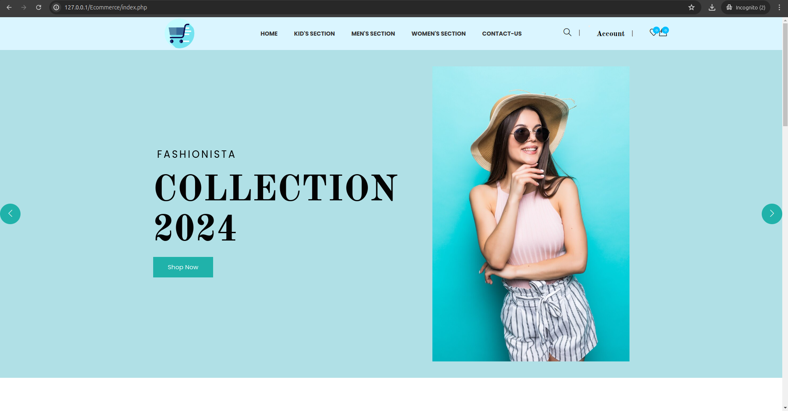
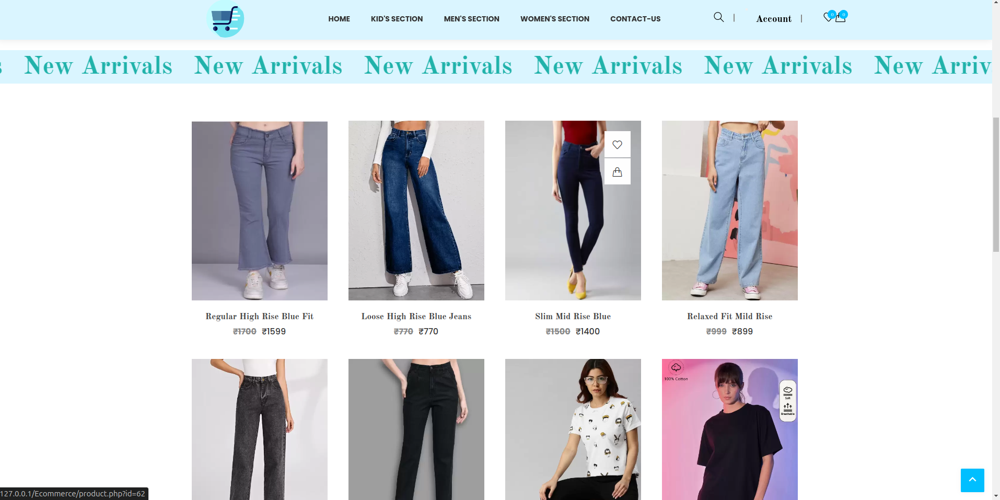
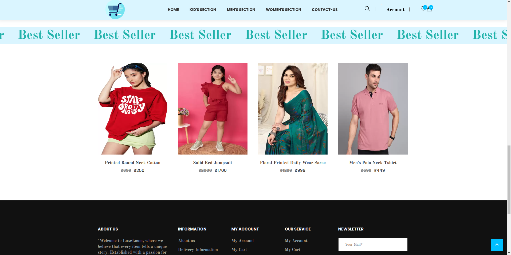
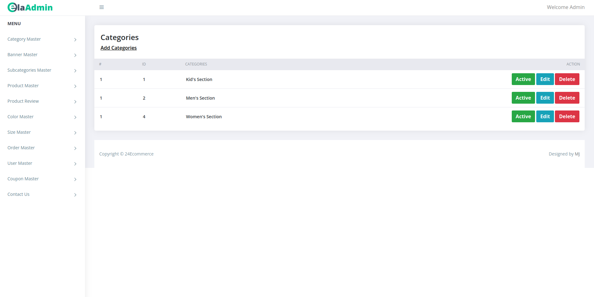
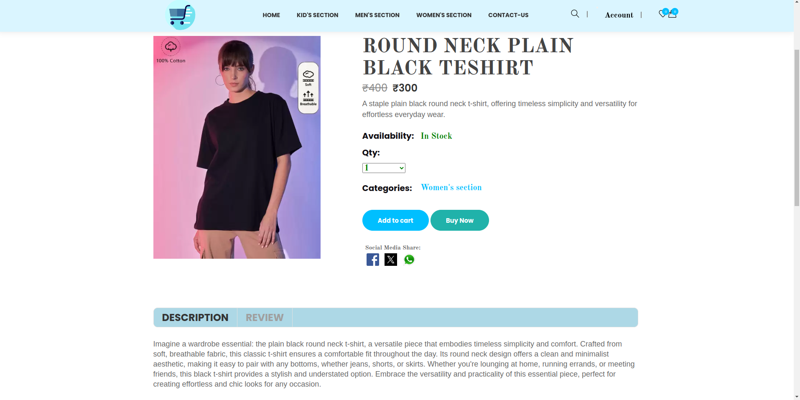
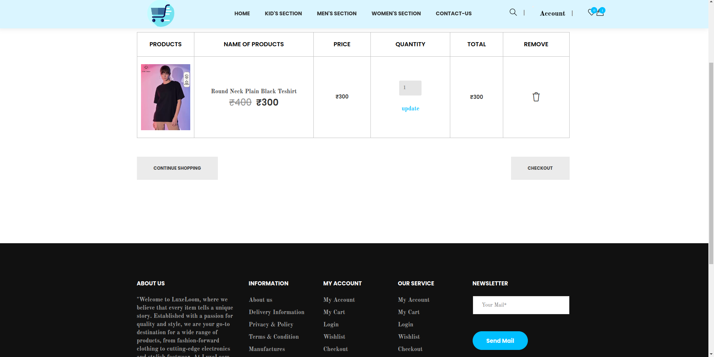
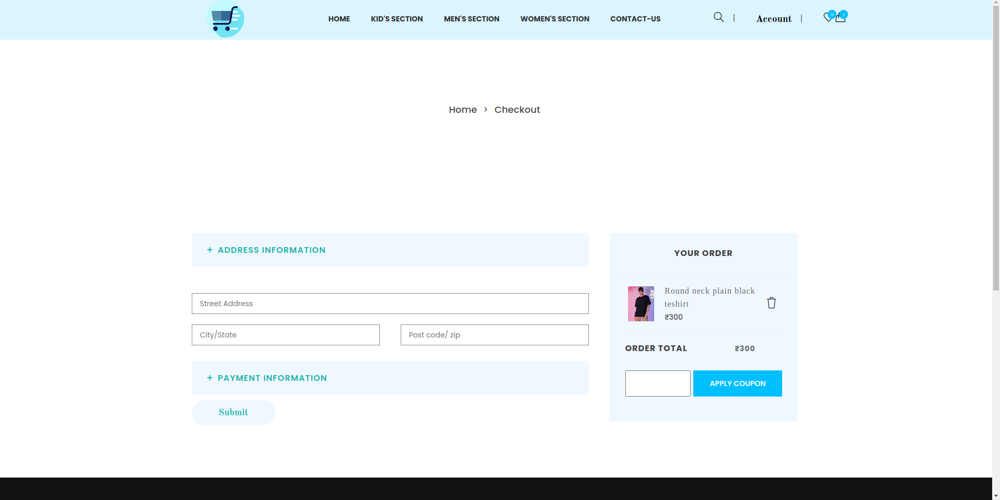

### Fashion Exchange Store - PHP Project README

Welcome to the Fashion Exchange Store README! This document provides an overview of our PHP-based eCommerce platform, designed for fashion enthusiasts to buy, sell, and exchange clothing items and accessories.

#### Table of Contents
1. **Introduction**
2. **Features**
3. **Screenshots**
4. **Installation**
5. **Usage**
6. **Contributing**
7. **License**

---

#### 1. Introduction

Fashion Exchange Store is an online marketplace built with PHP, MySQL, and Bootstrap, offering a user-friendly interface for trading fashion items. Whether you're looking to refresh your wardrobe sustainably or find unique pieces, our platform facilitates seamless transactions and exchanges between users.

---

#### 2. Features

- **Buy** Users can purchase fashion items for sale, complete with descriptions, prices, and images.
- **Exchange:** Facilitate item exchanges directly between users to diversify fashion collections.
- **Search & Filter:** Easily find specific items using search and filter functionalities.
- **User Authentication:** Secure user registration, login, and profile management.
- **Responsive Design:** Ensures a seamless experience across devices.
- **Admin Panel:** Manage users, listings, and site settings through an intuitive admin dashboard.
- **Messaging System:** Enable communication between buyers and sellers for smooth transactions.
- **Feedback & Rating:** Leave reviews and ratings to maintain trust and improve user experience.
- **Social Media Integration:** Share listings and engage with the community on social platforms.

---

#### 3. Screenshots


*index.php*


*product.php(New Arrivals)*


*product.php(Best Seller)* 


*Admin Panel*


*Product Description & review*


*Cart.php*


*Checkout.php*

STEPS
---

#### 4. Installation

To run Fashion Exchange Store locally or on a server, follow these steps:

1. **Clone Repository:**
   ```
   git clone https://github.com/js-engineer100/Ecommerce-Fashion-exchange.git
   ```

2. **Database Setup:**
   - Create a MySQL database name it ecommerce.
   - Import `ecommerce.sql` file provided in the `database` folder in the ecommerce database to set up tables.

3. **Configuration:**
   - Check `connection.php`.
 

4. **Run:**
   - Start your PHP development server or configure Apache/Nginx to serve the application.

---

#### 5. Usage

- **User Registration:** Sign up for an account to start buying fashion items.
- **Listing Items:** Create detailed listings with photos, descriptions, and prices.
- **Buying:** Browse items, add to cart, and proceed to checkout securely.
- **Exchanging:** Initiate exchanges with other users and negotiate terms.
- **Admin Dashboard:** Access the admin panel (`/admin`) to manage users, listings, and site settings.

---

#### 6. Contributing

Contributions are welcome! To contribute to Fashion Exchange Store:
- Fork the repository and create your branch.
- Make changes and test thoroughly.
- Submit a pull request with a detailed description of your changes.

---

#### 7. License

Fashion Exchange Store is licensed under the [MIT License](LICENSE.txt).

---

Thank you for exploring Fashion Exchange Store! We aim to provide a dynamic platform for fashion enthusiasts to connect, trade, and discover new styles sustainably. For any questions or feedback, contact us at support@fashionexchangestore.com.

Happy Shopping and Swapping!
